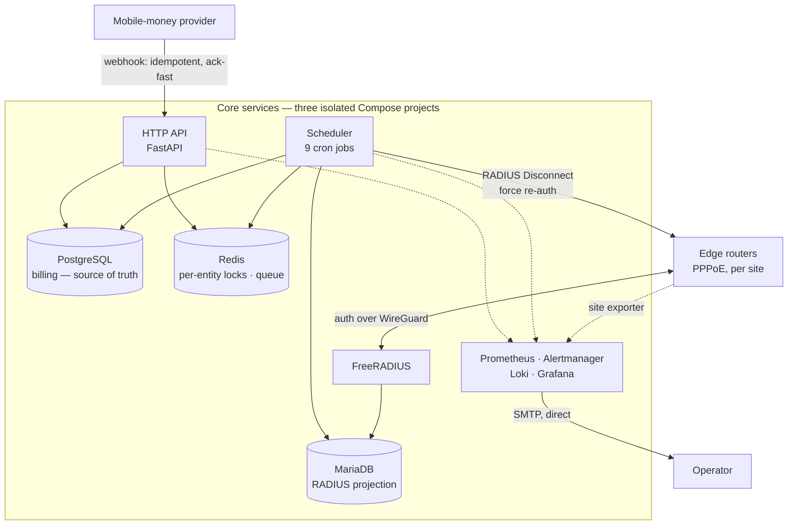

# ISP Billing & Network Platform — architecture case study

[](https://github.com/ndonye-ndunda/isp-platform-case-study/actions/workflows/ci.yml)

Prepaid billing and network access control for a fibre ISP in Kenya. Live, in
production, taking real money.

A subscriber pays into a mobile-money short code. The platform works out who
paid, tracks their billing cycle, and tells routers at each site who gets
internet — connecting people within seconds of payment and suspending them when
a cycle lapses. Money and network state have to agree, continuously, without
anyone watching.

> **This repository is a case study, not the source.** It documents the
> architecture, the engineering decisions and the failure modes. The production
> code, business rules, credentials and infrastructure detail are not here and
> will not be — see [SECURITY.md](SECURITY.md). The examples are independently
> written illustrations, and they are linted, strictly type-checked and tested
> in CI.

---

## Why it is technically interesting

Not throughput — this is not a high-volume system. Every hard constraint comes
from somewhere else:

**Money is real.** A double-credit isn't a bug report, it's a wrong bank
balance. Payment confirmations arrive asynchronously from a third party with no
exactly-once guarantee, so the ingress must be idempotent on the provider's own
transaction id, and correctness requirements don't scale down with row count.

**The state is physical.** Being wrong means a paying household has no
internet — and nobody learns that from a dashboard, they learn it because
someone phones. A database row has to become a shaped PPPoE session on a router
at a remote site, across a link you do not control, in seconds.

**Failures have to announce themselves.** The design assumes nobody is sitting
and watching, so an ambiguous signal is the same as no signal: everything must
be automatic or loud. This is the strongest forcing function in the whole
design, and it is why the observability work is the most developed part of it.

---

## Architecture



**One image, two entrypoints.** API and scheduler share a built image and run as
separate containers — identical domain logic, independent failure. A scheduler
wedged on a slow router doesn't stop the system taking money.

**Three stores, three contracts.** PostgreSQL is authoritative for money.
MariaDB is a projection that FreeRADIUS reads, so the billing app is *not* on
the authentication path — subscribers keep connecting during a deploy. Redis is
ephemeral coordination: losing it costs availability, never money.

**The migration tool cannot see the RADIUS tables.** Separate ORM metadata
registries, so autogenerate is *structurally* unable to propose dropping them.
When a destructive default exists, remove the capability rather than remembering
not to ask for it.

---

## Stack

| | |
|---|---|
| **Language / API** | Python 3.12, FastAPI, Pydantic, SQLAlchemy 2.0 (async), Alembic |
| **Data** | PostgreSQL (billing), MariaDB (RADIUS), Redis (locks, queue, rate limiting) |
| **Async** | APScheduler — 9 scheduled jobs in a dedicated container |
| **Integrations** | Mobile-money C2B payment gateway (live money rail), SMS gateway |
| **Network** | FreeRADIUS, PPPoE, RADIUS Disconnect-Message, MikroTik RouterOS, SNMP, WireGuard |
| **Observability** | Prometheus, Alertmanager, Grafana, Loki, Alloy, node-exporter, a custom exporter |
| **Infra** | Docker Compose ×3, Linux VPS, Nginx (TLS), private overlay VPN, managed DNS |
| **Quality** | pytest (~920 tests), ruff, mypy, pre-commit convention guards, GitHub Actions |
| **AI** | Local LLM inference, MCP tool servers, read-only tool gateway |

Deliberately **not** claimed, so the list above is not read as more than it is:
no continuous *deployment* (CI only), no Kubernetes, no asymmetric-token auth
experience, and no machine learning in production.

---

## Six engineering problems

1. **Idempotent money ingress with an honest acknowledgement.** The `2xx`
   returns once the credit commits and *before* activation — because holding the
   provider's connection open across a UDP command to hardware turns a slow
   router into a webhook timeout into a duplicate delivery. "Paid" and "active"
   are separate claims and the system never conflates them.
   → [§2](docs/02-billing-and-payments.md)

2. **A database row becoming a shaped network session.** Group-based
   entitlement plus a forced re-authentication, so a change applies in seconds
   rather than at next reconnect. The packet layer does *only* packets — no
   lock, no database, no audit — because its failure taxonomy needs business
   context it doesn't have. → [§3](docs/03-network-integration.md)

3. **Two stores and no distributed transaction.** Commit ordering chosen so the
   only reachable inconsistency is the one reconciliation can *see* and repair
   idempotently. When you can't have atomicity, choose which inconsistency you
   get. → [§4](docs/04-distributed-systems-patterns.md)

4. **Alerting that doesn't depend on what it monitors.** Infra alerts originally
   routed through the app's own notification pipeline — so the app couldn't page
   about being down. Split by origin: Alertmanager mails directly; business
   notifications keep the rich path.
   → [§5](docs/05-observability-and-operations.md)

5. **Cost as a testable invariant.** Every SMS must fit one GSM-7 segment,
   because a split message costs twice as much to send. That's a money rule, so
   it's a build-failing test — not a style guide.
   → [§4](docs/04-distributed-systems-patterns.md)

6. **Conventions enforced by a linter.** Naive `datetime.now()` in billing code,
   `float()` near money, an unpinned RADIUS retry default — each traceable to a
   real defect, each now a check that fails the build. A convention that isn't
   mechanically enforced degrades to a preference, invisibly.
   → [§7](docs/07-failure-modes-and-lessons.md)

---

## The theme: everything broken looked like it worked

A review of the notification subsystem produced twenty-one findings. They were
one finding, twenty-one times:

| Component | Reported | Reality |
|---|---|---|
| Workflow engine | empty `200` | the run had errored |
| SMS gateway | `201 Created` | request *accepted*, not delivered |
| Backup pipeline | exit `0` | valid, **empty** archive |
| Alert rules over an absent series | no alert | the rules could never fire |
| LLM with a truncated context | fluent answer | never saw its tools |
| Unimplemented stub | audit `SUCCESS` | nothing happened |

So the delivery log agreed with itself perfectly and disagreed with reality.

**This is the same problem AI systems have.** A model's output is uniformly
fluent: correct and incorrect answers arrive with identical confidence, at
identical length. `200 ≠ succeeded` and `confident ≠ correct` are one failure
class, and the engineering response is the same one — ground claims in
retrievable evidence, restrict capability instead of requesting good behaviour,
measure the thing rather than the proxy, and alert on silent degradation.

I learned it from a workflow engine returning empty `200`s, not from working on
AI. → [§7](docs/07-failure-modes-and-lessons.md)

---

## AI engineering

Split honestly, because the distinction matters more than the length of the list.

**Built, deployed, verified against live production data:** a read-only
operations agent. Natural-language questions about the platform, answered by
**MCP tool calls** that execute PromQL and LogQL against the real observability
stack. The model has no filesystem, no database, and no log text in context
except what a tool returned.

- **Read-only enforced at two independent layers** — a Viewer-role credential
  *and* a flag that strips mutating tools from the schema. The capability is
  *absent*, not forbidden; there's no jailbreak for a tool the model was never
  told about.
- **PII redacted upstream of the model**, at the log-shipping edge. Asking a
  model to redact is asking the weakest-guarantee component to enforce the
  strongest requirement.
- **Measured, not estimated:** 15 tool schemas were ~7,100 of a 9,216-token
  prompt; at ~4 tok/s on CPU that's 40 minutes to first token. Tool count is a
  context-budget decision, and prompt processing — not generation — was the
  entire bottleneck.
- **A silent failure worth the write-up:** below a sufficient context window the
  tool schemas truncated with no error, so the model answered confidently
  *without querying anything*. It presented as a model capability limit. It was
  configuration, layered across three places, each overriding quietly.
- **A named threat:** log-borne prompt injection — reverse-proxy paths and RADIUS
  usernames are attacker-influenceable and reach the model by design. Bounded by
  capability restriction, not prompt hardening.
- **Deliberately not ML:** the production churn score is a transparent additive
  rubric with its breakdown persisted for explainability, because the labelled
  data for a classifier does not exist yet and a number with a decimal point
  would have added opacity, not information.

**Designed, not built:** billing-explanation and support assistants, RAG over
the operational corpus (whose hard part is *supersession* — the decision log
contains reversals, and naive retrieval returns retired architecture with
confidence), an approval-queue write path with allowlists and a kill switch, and
an evaluation strategy scoring grounding, completeness, calibration and refusal
separately.

Nothing in that second group is implemented, and the document says so on every
item. → [§6](docs/06-ai-engineering.md)

---

## My role

I architected, specified, directed, tested and operated this system, using
AI-assisted development extensively as an engineering tool. I established the
architecture, engineering constraints, verification gates and acceptance
criteria, and personally validated the resulting system in production.

The judgment calls this repository documents are mine — the commit ordering that
makes the detectable inconsistency the reachable one, splitting alerting by
origin, inverting the notification transport, choosing a transparent rubric over
a model the data could not support, and enforcing conventions with a linter
rather than a style guide. Each is recorded with its reasoning in a decision log
that keeps its reversals, so a later reader can see not just what was chosen but
what was rejected and why.

---

## Read in this order

**2 minutes:** this page.

**15–30 minutes:** the technical documents.

| | |
|---|---|
| [1. System architecture](docs/01-system-architecture.md) | Components, three stores, trust boundaries, security posture |
| [2. Billing and payments](docs/02-billing-and-payments.md) | Money model, idempotency, ack-fast, cycle state machine |
| [3. Network integration](docs/03-network-integration.md) | PPPoE/RADIUS, forced re-auth, vendor-neutral site telemetry |
| [4. Distributed systems patterns](docs/04-distributed-systems-patterns.md) | Locking, commit ordering, crash-as-signal, queue design |
| [5. Observability and operations](docs/05-observability-and-operations.md) | The absent-series problem, alert independence, deployment |
| [6. AI engineering](docs/06-ai-engineering.md) | Built vs designed, guardrails, evaluation, measured limits |
| [7. Failure modes and lessons](docs/07-failure-modes-and-lessons.md) | The theme above, in full, plus what I'd do differently |

**Then the code:** [`examples/`](examples/) — 11 modules, 119 tests, green in CI.

```bash
pip install ruff mypy pytest fastapi httpx
ruff check . && mypy examples/ && pytest
```

---

## What is intentionally omitted

Production source, business rules, payment-gateway integration, credentials,
customer data, infrastructure identifiers, configuration, dashboards, runbooks,
and the AI agent's system prompt.

The operator is anonymous throughout, and so is every commercial service
provider — the payment rail, the SMS channel, hosting, DNS, object storage and
the model are all referred to by function rather than by name. Self-hostable
platforms that carry a technical point are named, because a case study you
cannot evaluate is not worth reading.

The governing rule is **describe the reasoning, never the configuration**: what
is here is why a class of design decision matters, not what any running system
currently does. Sample values are fabricated and their synthetic-ness is
asserted by the test suite rather than asserted in prose.

Full reasoning, and how to report anything that looks like a leak, in
[SECURITY.md](SECURITY.md).

---

<sub>Documentation © 2026 ndonye-ndunda. All rights reserved. Example code under
MIT — see [LICENSE](LICENSE).</sub>
