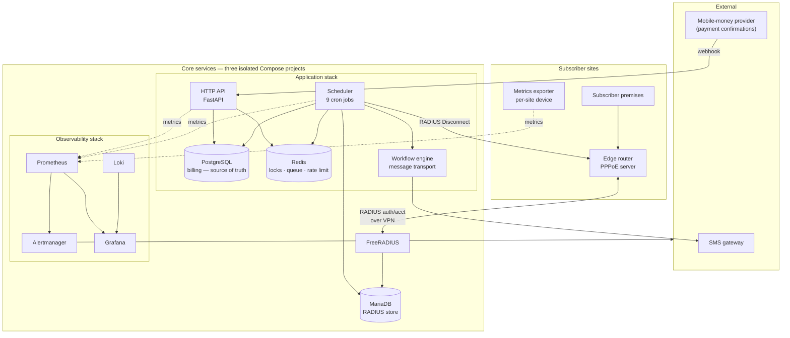
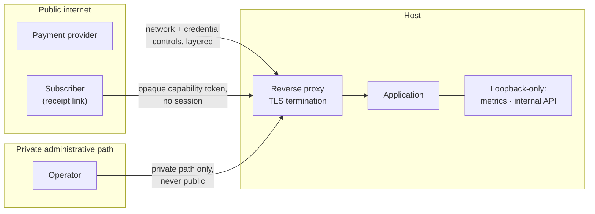

# 1. System architecture

> Part of an architecture case study. No production source, configuration or
> infrastructure identifiers appear here — see [SECURITY.md](../SECURITY.md).

## What the system has to do

An ISP takes money and, in exchange, lets electrons move. Those are two different
worlds and the whole platform exists to keep them in agreement:

- A subscriber pays into a mobile-money short code. Money arrives asynchronously,
  from a third party, with no guarantee of ordering or exactly-once delivery.
- A router at a physical site decides, on each PPPoE session, whether that
  subscriber gets bandwidth and how much.

Between those two facts sits every interesting problem in the system. The gap is
measured in *seconds a paying customer spends disconnected*, and it is the number
the architecture is organised around.

## Components



Two things in that diagram are deliberate and non-obvious, and both are covered
below: the authenticator is intentionally *not* on the billing application's
deployment path, and Alertmanager sends its own mail rather than going through
the application's message transport.

## One image, two entrypoints

The API and the scheduler are the same built image with different commands. They
run as separate containers.

Sharing the image means the domain layer — money parsing, cycle arithmetic,
locking, audit — is provably identical in both. There is no "the worker computed a
slightly different charge than the API would have" failure available, because there
is only one implementation compiled into one artifact.

Splitting the *process* means a scheduler that wedges on a slow router does not
stop taking money, and the API can be restarted without skipping a billing run.

A consequence worth stating because it has bitten before: **the image is the
deployment unit.** There is no source mount in production. Pulling the repository
on the server changes nothing until the image is rebuilt and the containers
recreated. "I pulled" and "I deployed" are different sentences.

## Three data stores, three different contracts

| Store | Holds | Contract |
|---|---|---|
| PostgreSQL | Subscribers, wallets, subscriptions, payments, refunds, audit, heartbeats | **Sole source of truth for money.** Integer minor units only. |
| MariaDB | FreeRADIUS credentials, group assignments, accounting | A *projection* of billing state, owned by an external daemon's schema. |
| Redis | Per-entity locks, message queue, rate-limit counters | Ephemeral coordination. Losing it costs availability, never money. |

The split is not incidental complexity — FreeRADIUS owns its schema and expects
its own tables. The platform's job is to write that projection correctly, and to
be honest with itself about which store is authoritative when they disagree.

### The migration-safety consequence

The two SQL stores are mapped through **separate metadata registries** in the ORM
layer. The migration tool is wired to the billing registry only, so it is
*structurally* incapable of seeing the RADIUS tables.

This is a guardrail, not a preference. A migration tool pointed at a database
containing tables it has no model for will, in autogenerate mode, cheerfully
propose dropping them. Here the tool cannot propose it, because from where the
tool stands those tables do not exist. Schema drift is verified by asking the
tool to diff models against the live schema and requiring an empty answer, rather
than by generating a candidate migration and eyeballing it.

The generalisable rule: **when a destructive default exists, prefer removing the
tool's ability to do the destructive thing over remembering not to ask for it.**

### The reconciliation consequence

Two stores that must agree, updated by different code paths, will eventually
disagree. So a scheduled job compares them and reports drift rather than assuming
consistency. It is read-only: it raises the discrepancy for a human instead of
picking a winner, because the correct resolution depends on *why* they diverged,
and a job that silently "fixes" state destroys the evidence needed to find the
cause.

## Layering

```
core/       money · time · locks · audit · logging · pure billing rules
db/         ORM models (two metadata registries) · session factories
services/   billing · radius · payments · notifications · gateways ·
            provisioning · churn · metrics · receipts
api/        HTTP surface, grouped by trust boundary (see below)
workers/    scheduler + the registered cron jobs
```

Dependencies point strictly downward. `core/` imports nothing from the layers
above it and does no I/O, which is what makes the billing rules unit-testable
without a database — and cheap enough to test exhaustively.

An honest note on this structure: a `repositories/` layer was planned and a
directory was created for it. It was never adopted; services talk to the ORM
directly. The directory sat empty for the life of the project. That is recorded
here rather than tidied away, because an empty layer is a small, useful datum
about how much abstraction a system this size actually needed — and the answer
was less than the plan assumed.

## Session discipline

Two entry points to the database, never mixed:

- A **request-scoped dependency** for HTTP handlers. It rolls back on exception and
  does *not* commit; handlers commit explicitly. Nothing gets persisted because a
  handler forgot to raise.
- An **async context manager** for workers and scripts. Auto-rollback on exception,
  explicit commit required.

Requiring the commit to be explicit is the point. In a system where one commit
means "we have taken this person's money", the write should be a statement
somebody wrote on purpose.

## Trust boundaries and security architecture



Four boundaries, four different trust models — stated separately because
collapsing them is how a control plane ends up on the public internet:

1. **A payment webhook has to be publicly reachable**, which makes it the one
   boundary you cannot shrink — so it gets layered controls that fail
   *differently*. The general design point: a network-level control tells you
   where a request came from and nothing about who sent it, while a credential
   tells you the reverse. Relying on either alone leaves a whole class of
   request indistinguishable from a legitimate one, and the two are worth
   reasoning about separately rather than adding up to a vague sense of
   "protected".
2. **A control plane does not belong on the public internet.** The strongest
   version of this is not a better credential, it is unreachability — an
   endpoint an attacker cannot address is not one they can attack. Credentials
   then defend against a narrower and more tractable threat.
3. **Machine-to-machine endpoints compare credentials as bytes, in constant
   time.** Two reasons, and the second is the one people miss: timing leakage is
   the textbook concern, but comparing *decoded strings* also means unexpected
   input can raise inside the comparison — turning an authentication check into
   an unhandled error. A type bug presenting as a security bug.
4. **Capability links carry an opaque token, no session, and no enumerable
   identifier.** The token grants read access to exactly one object; possessing
   one reveals nothing about the existence of any other.

Two further deliberate positions:

- **Admin API keys are stored as bcrypt hashes**, never plaintext or a fast
  digest — and the cost of that has to be designed for rather than discovered.
  A deliberately slow hash is the right primitive and a hazard on an async
  request path: verifying an *unidentified* key means hashing against candidate
  rows, at hundreds of milliseconds each, inside an event loop shared with every
  other request. Two things make it safe, and both belong in the design rather
  than in a later fix — a non-secret indexed prefix on each key so exactly one
  candidate is ever hashed, and running the hash off the event loop. The general
  lesson is that a correct security primitive can create an availability problem,
  so "is this cryptographically sound?" and "where does this run?" are two
  questions, not one.
- **PII is redacted at the log-shipping edge**, before logs reach the aggregator —
  not at query time and not in the UI. Redaction that happens after storage means
  the plaintext is in storage. See [§5](05-observability-and-operations.md).

### Security as a register, not a checklist

Security findings live in a register with a severity class, an owner, and — for
anything not being fixed now — an explicit **revisit trigger**. Entries are
allowed to say *deferred* and *declined*, provided they say why.

Two habits make the register worth keeping rather than performing.

**"Declined" is a legitimate outcome, and it has to be written down.** A finding
whose mitigation would duplicate a control that already exists — often a human
process rather than a technical one — should be closed with that reasoning
stated, not left open forever as a quiet reproach. An open item nobody intends
to action trains you to skim the register, which costs you the items that
matter.

**Re-estimate before implementing, because the cheap fix is sometimes the wrong
one.** The pattern worth internalising: validation added at the wrong layer can
convert a *visible* gap into a *silent* one. Reject deep inside a call path
whose outer boundary must still acknowledge its caller, and the rejection
becomes invisible — request accepted, work not done, a log line as the only
trace. Validation of that kind belongs at the boundary, paired with an alert and
a durable record, which is a larger change than the one-line version and the
right one.

That second habit is the thesis of this case study arriving in a security
review: a fast fix that trades a visible gap for a silent failure has made
things worse, and *"it's only a one-line change"* is precisely when to check
which of the two you are shipping. See
[§7](07-failure-modes-and-lessons.md).

## On scale

This is not a high-volume system, and someone will reasonably ask why it needs
this much architecture.

It doesn't need it for *throughput*. Every load-bearing constraint here comes from
somewhere else:

- **Money is real.** A double-credit is not a bug report, it is an incorrect bank
  balance. Correctness requirements do not scale down with row count.
- **The state is physical.** Being wrong means a paying household has no internet,
  and nobody finds out from a dashboard — they find out because someone phones.
- **Nothing may depend on a human noticing.** Everything must either be
  automatic or be visible. This is the strongest forcing function in the entire
  design: an alert that does not fire is indistinguishable from a system that is
  healthy, and no amount of attention closes that gap — only instrumentation
  does.

Scale changes which problems are hard. It does not decide whether the ones you
have are worth solving properly.

---

**Next:** [2. Billing and payments](02-billing-and-payments.md) ·
[7. Failure modes and lessons](07-failure-modes-and-lessons.md)
