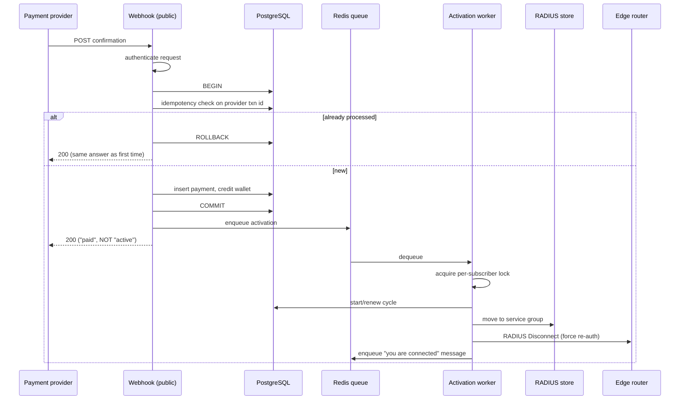
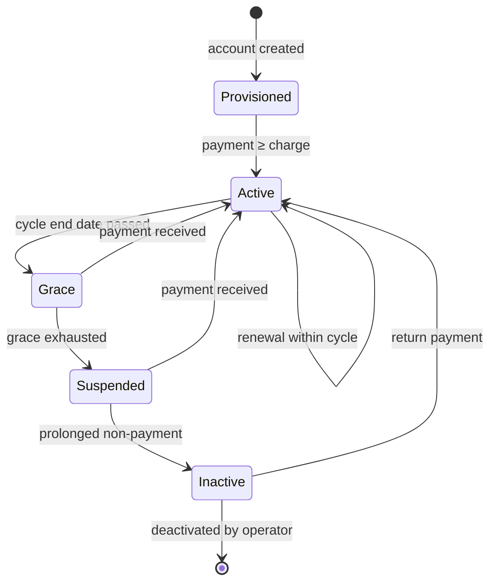

# 2. Billing and payments

> Illustrative architecture. The production billing rules, decision tree,
> pricing and gateway integration are not reproduced here — see
> [SECURITY.md](../SECURITY.md).

## The money model

Three rules, and everything else follows from them.

**1. One store is authoritative.** The billing database holds the balance. The
payment provider's records are an input, the RADIUS store is an output, and
neither is ever consulted to answer "what is this person's balance".

**2. Money is an integer count of minor units.** Never a float, never a decimal at
rest. `2_500_00` cents, not `2500.00`.

Floating point in a currency column is not a style question. `0.1 + 0.2` is not
`0.3` in IEEE 754, and the error compounds across a ledger. The failure mode is
the worst kind: a balance that is *almost* right, indefinitely, until it drifts far
enough for a human to notice — by which point the transaction that caused it is
long gone.

**3. Parsing happens at exactly one boundary.** External currency strings enter
through a single function: string → `Decimal` → integer minor units. Nothing
else in the codebase is permitted to construct an amount from external input.

That third rule is what makes the second enforceable. One conversion point is a
place you can test exhaustively — negatives, empty strings, thousands separators,
exponent notation, more decimal places than the currency has, `None`, `NaN`,
`Infinity`, a value that overflows. Ten conversion points is a place where the
eleventh gets it wrong.

See [`examples/domain/money.py`](../examples/domain/money.py) for a working,
tested implementation of this pattern, and its test file for the case list.

### The guard that makes it stick

A convention documented in a style guide is a suggestion. This one is a
pre-commit and CI check that fails the build on `float(` appearing near an
identifier that looks like money, and on `int(float(...))` anywhere — the classic
truncation bug — within the billing and worker packages. Tests and display code
are out of scope, deliberately.

The check is crude. It greps. It has false positives, and there is an
escape-hatch comment for them. It is still worth more than the style guide,
because it runs.

See [`examples/guards/convention_guards.py`](../examples/guards/convention_guards.py).

## Time is a correctness concern, not a formatting one

The business runs in East Africa Time; servers run in UTC. A billing cycle that
ends "today" is a question about a specific calendar day in a specific zone.

Naive `datetime.now()` in billing code is therefore a *bug*, not a smell — it
silently answers a UTC question and is wrong for three hours out of every
twenty-four. A cycle that should end on the 5th ends on the 4th for anyone
processed late in the evening.

Two enforcement points:

- All business-logic time goes through zone-aware helpers. A guard rejects naive
  `datetime.now()` / `date.today()` in the billing and worker packages.
- Every scheduled job must declare its timezone explicitly rather than inheriting
  the scheduler default. This too is mechanically checked: constructing a cron
  trigger anywhere except the one registration wrapper fails the build.

The second guard exists because the failure is invisible. A job with the wrong
timezone runs perfectly, at the wrong hour, forever, and the only symptom is that
the daily suspension sweep starts running before the day it is meant to evaluate
has ended.

## Payment ingress: exactly one active rail

Where a system supports more than one payment integration, **exactly one should
be able to accept money at a time**, and a rail that is not the active one should
refuse rather than quietly work.

The reason is idempotency, and it is worth being precise. Each rail derives its
idempotency key from its own provider's transaction identifier. Two rails
accepting simultaneously means two independent key spaces over one balance, and a
double-credit becomes reachable through a route that no single-rail test covers.
An explicit refusal also makes "which rail can take money" a single readable
fact rather than something inferred from configuration spread across modules —
and a fact a test can assert.

Building rails that are then deliberately switched off deserves a comment. Two of
the three were built against real provider sandboxes and are complete; the
business direction changed. That is written down as a dated decision — including
the reversal of an earlier decision that had gone the other way — rather than
being deleted or quietly left ambiguous. A codebase where the dormant paths are
labelled dormant is navigable; one where they are indistinguishable from live
paths is a trap.

## The payment path

Three properties of that sequence carry most of the weight.

### Idempotency keyed on the provider's identifier

The provider's transaction id is the key. It is unique, and — critically — it is
*stable across retries*, which a locally generated key would not be. A duplicate
confirmation finds the existing record and returns the same response it returned
the first time.

Payment providers retry. They retry when your response was slow, when it was lost,
and sometimes when it succeeded. Any endpoint that credits money must assume it
will be called more than once with the same payload, and the only reliable defence
is a uniqueness constraint in the database — not an application-level check, which
races against itself under concurrent delivery.

### Acknowledge fast, activate asynchronously

The `2xx` is returned once the credit has committed, **before** the cycle is
activated and before the router is touched.

This is a deliberate split of two claims that are tempting to conflate:

- **"We have your money"** — synchronous, transactional, must be durable before
  responding.
- **"Your internet is on"** — involves a lock, a second database, a UDP packet to
  hardware over a VPN link that may be down, and a router that may take seconds.

Holding the provider's connection open across the second one means a slow router
turns into a webhook timeout, which turns into a provider retry, which turns into
duplicate-delivery pressure on the money path. So the response commits the money
and returns; activation is queued.

The cost is a genuine window where the ledger says paid and the network says no.
That window is *named*, worked, and reported on — an activation sweep re-attempts
anything the primary path abandoned, and abandoned activations raise an alert. The
architecture doesn't pretend the window is closed; it makes the window observable.

The user-facing corollary: **the system never claims "active" until reconnection is
confirmed.** The confirmation message is sent by the activation path, not by the
webhook. Telling someone their internet is on while it isn't is worse than telling
them nothing.

### The lock is acquired outside, exactly once

Everything that mutates subscriber state — subscription status, RADIUS group,
disconnect — happens inside a per-subscriber mutex, acquired once at the outermost
boundary. Details in [§4](04-distributed-systems-patterns.md).

## Cycle state

The transitions are the interesting part, not the states:

- **Grace exists because payment is asynchronous and human.** Someone paying on
  the due date at 22:00 through a mobile-money agent should not be disconnected
  because the confirmation landed after a worker ran.
- **Money is only ever added by a payment or an operator with an audit trail.**
  There is no code path that decrements a balance as a side effect of a state
  change.
- **A surplus balance can renew a cycle without a new payment.** Which makes
  "renewal" and "payment" separate events, and means the notification for each has
  to say something different and true.
- **Suspension is a batch decision, activation is an event-driven one.** Paying
  should reconnect you in seconds. Not paying is evaluated on a schedule, because
  it is a decision about a whole population and it needs to be reproducible.

## Grandfathered pricing

Some subscribers are on legacy pricing: their charge is not their plan's list
price. Any billing system that runs long enough acquires a cohort like this, and
the interesting question is where the exception is allowed to live.

The mechanism is one function: *given a subscription, return the effective
charge*, consulting a per-subscription override before the plan default. Nothing
else in the codebase reads the plan price directly for billing purposes.

The design lesson is about where the exception lives. The naive implementations
are a conditional at each call site (which is wrong the first time somebody adds
a call site) or a duplicated plan row per legacy price (which multiplies plans by
cohorts forever). One resolver function means the exception exists in a single
place, and adding a second kind of exception later is a change to one function
rather than an archaeology exercise.

It also has to be *findable*. A new contributor reading `plan.monthly_charge` has
no way to know it is the wrong field. So that's a documented convention with a
stated reason — and the kind of thing a guard would be well suited to catch.

## What this system deliberately is not

- **Not a general ledger.** No double-entry, no chart of accounts. It tracks
  subscriber balances and payments. Accounting integration is a separate concern
  and was left separate.
- **Not a payment processor.** It never initiates a payment or moves money
  outward. Money flows one way. Refunds are wallet credits, which keeps the
  system out of the business of sending funds anywhere.
- **Not multi-currency.** One currency, one set of minor units. Introducing a
  second would mean revisiting every integer in the schema, and pretending
  otherwise now would be a lie told in advance.

Each of those is a scope decision with a reason, which is the difference between
a boundary and a gap.

---

**Next:** [3. Network integration](03-network-integration.md) ·
**Back:** [1. System architecture](01-system-architecture.md)
