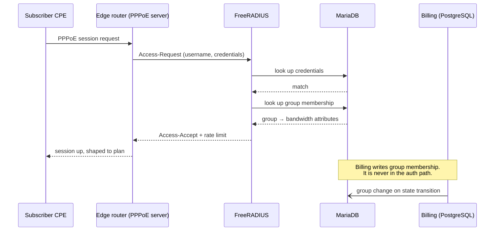

# 3. Network integration

> Illustrative architecture. No router configuration, RADIUS secrets, VPN
> topology, addressing or site detail appears here — see
> [SECURITY.md](../SECURITY.md).

This is the layer where a database row becomes, or stops being, a working
internet connection.

## The authentication path



The property that matters: **the billing system is not on the authentication
path.** FreeRADIUS answers the router by reading MariaDB. If the billing
application is down, restarting, or mid-deploy, subscribers keep authenticating
and existing sessions keep working.

That is a deliberate reliability boundary. The billing platform holds a hot,
correct projection of entitlement in the store the authenticator already reads,
rather than inserting itself as a synchronous dependency of every session
establishment. Availability of the control plane is decoupled from availability of
the service.

The trade-off is the one from [§1](01-system-architecture.md): two stores that can
disagree, which is why reconciliation is a first-class scheduled job rather than
an afterthought.

## Entitlement is group membership, not a per-user attribute

Plans map to RADIUS groups. A subscriber's plan and status resolve to exactly one
group; the group carries the bandwidth attributes. Changing someone's service
means changing which group they are in.

Why groups rather than per-subscriber attributes:

- One place to change a plan's shaping, rather than N subscriber rows.
- Suspension becomes a group move — a *configuration* with its own attributes
  rather than a deletion. That matters because deleting credentials to suspend
  someone makes the reconnection path "recreate the account", which is a far
  worse operation to get wrong, and it destroys the record of what the
  subscriber was entitled to before. Whatever the suspended group is permitted
  to reach is then a policy decision to make explicitly, with its own threat
  model, rather than a side effect of how suspension was implemented.
- Auditing "what is this person entitled to" is one read.

One plan needed a hard bandwidth cap that the group attributes alone couldn't
express, so it carries a rate limit alongside the router's own queue
configuration. Those two mechanisms coexisting is a real wrinkle, documented as
such: the second mechanism is not a duplicate of the first, and removing either
changes behaviour.

Adding a plan touches four layers — billing plan record, RADIUS group, router
queue configuration, and the message copy that names it. That's written up as a
four-step procedure rather than discovered each time, because the failure mode of
missing step three is a subscriber who is billed correctly and shaped wrongly.

## Making a change take effect *now*

A group change in the database applies at the subscriber's next authentication.
For an active PPPoE session, that could be days away. Someone who has just paid
will not wait.

So a state change is followed by a **RADIUS Disconnect-Message** to the router,
which tears down the session; the CPE immediately redials and re-authenticates,
picking up the new group.

Two notes on the choice:

- The obvious-sounding alternative, a **CoA-Request** (Change-of-Authorization,
  which modifies a live session in place), is not used. Forcing a full re-auth
  makes the database the single source of what the session should look like. A CoA
  layers a delta onto a live session, so the session's actual shaping becomes
  "whatever the database said at dial time, plus every delta since" — state that
  exists nowhere except in the router. Disconnect-and-redial is a heavier hammer
  and a cheaper mental model, and the cost is a sub-second interruption for
  someone whose service is being changed anyway.
- The sequence is *write, then disconnect, then commit*. The RADIUS projection is
  written and the disconnect is attempted before the billing transaction commits,
  so a failed disconnect can still abort the whole operation rather than leaving
  billing claiming a state the network never reached.

### The disconnect service does exactly one thing

The module that speaks RADIUS to a router does **not** acquire the lock, touch
PostgreSQL, write audit records, or enqueue notifications. It sends a packet,
interprets the response, and returns a typed result. All four of those
responsibilities belong to the caller, which inspects the result and decides
whether to commit, what to audit, and whom to alert.

This is unusually strict for a small codebase, and it was worth it. Network I/O
against physical hardware over a VPN has a rich failure taxonomy — no response,
explicit rejection, wrong shared secret, host unreachable, session not found,
multiple sessions found. Each needs a *different* decision, and those decisions
depend on business context the network layer does not have. Keeping the packet
layer pure means the retry policy, the audit semantics and the alerting all live
where the context is, and the network layer stays testable against a fake router
with no database in sight.

### A library default that corrupted retries

The RADIUS client library defaults to three internal retries per request.

That interacts badly with orchestration that also retries: the caller thinks it
has made one attempt with a known timeout, while the library has made three,
tripling the elapsed time and making the observed timeout meaningless. Worse, the
caller's own backoff is computed against a duration that isn't what it thinks.

The fix is one line — pin the library's retry count to one and own retries at the
orchestration layer. The interesting part is that this is now a **build-failing
check**: constructing one of those clients without pinning retries fails CI. The
bug was found once, and the cost of finding it again was judged higher than the
cost of a grep rule.

That pattern — *a subtle bug in a dependency default becomes a mechanical
check* — recurs throughout this system. See
[§7](07-failure-modes-and-lessons.md).

## Site connectivity

Each site has an edge router acting as PPPoE concentrator, reaching the central
FreeRADIUS over a **WireGuard** tunnel. Subscriber traffic is local to the site;
only authentication, accounting and management cross the tunnel.

The architectural trade this makes is worth naming, because it is the one every
centralised-authentication design makes and it is easy to make accidentally:
**centralising authentication buys one place to decide entitlement, and pays for
it in local availability.** A site whose path to the authenticator is impaired
cannot establish *new* sessions, however healthy its own hardware is.

The failure shape is the interesting part. Existing sessions are unaffected,
because authentication happens once per session rather than continuously. So the
impact does not arrive all at once — it accumulates as customer equipment
naturally redials over hours. That is *harder* to diagnose than an instant
outage, not easier: the symptom is a slowly rising trickle of unrelated-looking
complaints, and the obvious hypotheses are all local.

Which sets the design requirements: monitor the authentication path itself as a
first-class target rather than inferring it from downstream symptoms, keep each
site independently administrable so a diagnosis does not depend on the impaired
path, and decide deliberately how much local autonomy each site should have —
because full local autonomy costs you the single decision point that was the
reason to centralise in the first place.

## Site telemetry

A small dedicated device at each site polls the local router and exports
Prometheus metrics. It is a separate subproject with its own tests and release
process, deliberately not part of the billing image — telemetry collection and
billing have different blast radii and should not share a deployment unit.

Its internal design is three layers, and the reason is portability:

```
sources/     one adapter per protocol — vendor API, SNMP, ICMP probe
normalize/   protocol-shaped responses → a vendor-neutral internal model
collectors/  internal model → Prometheus metric families
```

Only `sources/` knows a vendor exists. The metric names, which become the
observability contract that dashboards and alert rules depend on, are produced
from the neutral model. Swapping router vendors at a future site is an additive
change in one directory; nothing downstream moves. Given that the alerting rules
and dashboards are the expensive artifacts, that boundary is placed where the
cost of being wrong is highest.

It is **read-only by construction** — the vendor adapters expose no write
operations at all. A metrics collector holding router credentials is a standing
risk, and the cheapest way to bound it is to make the write capability absent
rather than unused.

### The failure that shaped the metric design

A metrics exporter has two ways to be wrong, and only one of them is obvious:

1. It reports bad numbers. Obvious, alertable.
2. **It reports nothing, and nothing notices.**

The second is the dangerous one, because in Prometheus an alert expression over an
absent series does not evaluate false — it evaluates *empty*, and an empty result
means "no alert". A site-down rule with no data behaves exactly like a healthy
site.

So the exporter publishes explicit health series of its own — per-source
reachability, poll duration, poll failures, last-success timestamps — and the rule
set includes guards that fire when the *series themselves* go missing. Full
treatment in [§5](05-observability-and-operations.md); the example rules are in
[`examples/observability/absent_guard.rules.yml`](../examples/observability/absent_guard.rules.yml).

## Credentials at rest, and why "just encrypt it" is not an answer

A control plane that reconfigures network equipment has to hold credentials for
that equipment. Where those live is a real decision with no free option, and the
reflex answer — encrypt the column — deserves more scepticism than it usually
gets.

**Encryption without a key-management story relocates the secret rather than
protecting it.** If the key sits next to the data, an attacker who can read one
can read the other, and you have bought obfuscation while telling yourself you
bought confidentiality. That is worse than plaintext with a clear-eyed threat
model, because it ends the conversation.

The options that actually differ, in increasing order of what they demand of
you: a dedicated secret store with its own auth and audit trail; envelope
encryption with the key held by a service the database cannot reach; or removing
the need — having the control plane hold only a short-lived, narrowly-scoped
credential it fetches per operation.

The engineering point is to pick one on purpose and write down what it assumes.
A decision recorded with its threat model and a revisit trigger is a decision.
The same configuration with no record is negligence that happens to look
identical from the outside — and the difference only becomes visible when
somebody asks why.

---

**Next:** [4. Distributed systems patterns](04-distributed-systems-patterns.md) ·
**Back:** [2. Billing and payments](02-billing-and-payments.md)
