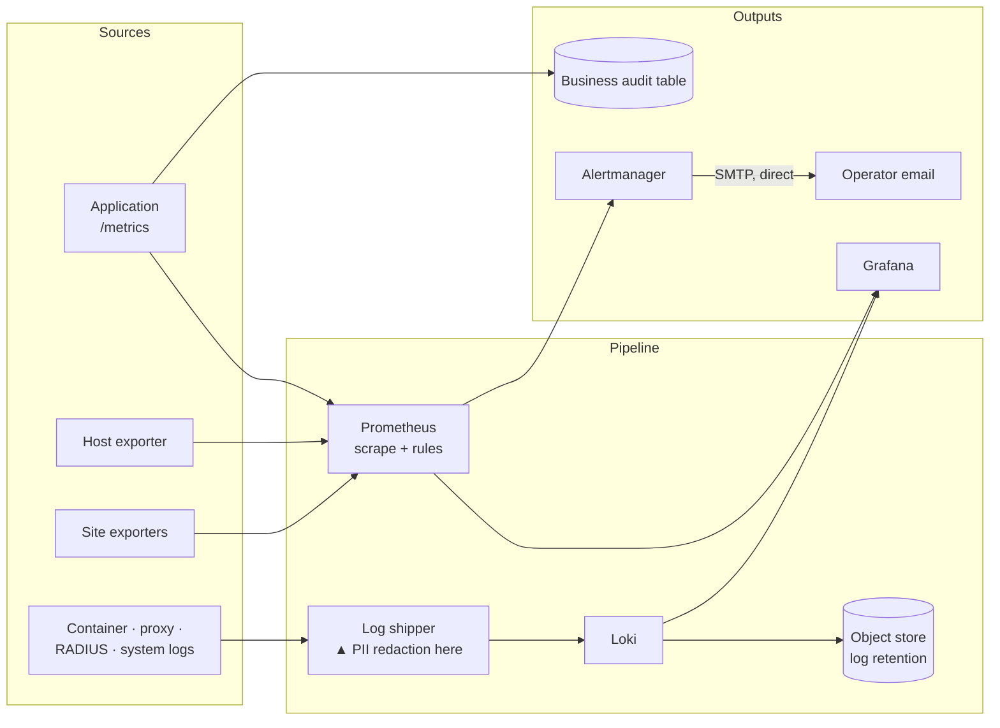

# 5. Observability and operations

> Illustrative architecture. No hostnames, addresses, dashboards, thresholds,
> runbooks or credentials appear here — see [SECURITY.md](../SECURITY.md).

## The constraint that shaped this

Design for the assumption that nobody is watching.

That premise does more work here than any technology choice. It means the only
acceptable failure mode is a **loud** one, and it means the question "would this
have alerted?" has to be asked of the monitoring itself, not just of the system
being monitored. An organisation with depth can absorb an ambiguous signal by
having somebody notice it; a design should not rely on that, because the
assumption is invisible until the one time it fails. Ambiguity is cheaper to
engineer out than to staff around.

## Layers

Five layers, and they answer different questions — which is why there are five and
not one:

| Layer | Answers | Retention |
|---|---|---|
| Business audit table | "What did the system decide about this subscriber, and why?" | Long |
| Metrics | "Is it working, and how hard is it working?" | Medium |
| Logs | "What exactly happened at 03:14?" | Short-to-medium |
| Alerts | "Do I need to look now?" | — |
| Dashboards | "What does normal look like?" | — |

The business audit table is worth calling out because it is the one that isn't in
the standard stack. It records domain events — *this subscriber was suspended, by
this job, with this reason, at this time* — with the churn-score breakdown or
disconnect result attached. Metrics can't answer that (they're aggregates) and
logs shouldn't be relied on for it (they expire, and they're prose). Business
decisions get a schema.

## The absent-series problem

This is the most valuable thing in this document.

In Prometheus, an alerting rule whose expression matches **no series** does not
fire. There is nothing to compare, so there is no alert. Which means:

> A rule written to detect "site is down" behaves *identically* to a healthy site
> when the exporter that would produce the data was never configured.

The shape of it: a set of site-health rules is written, reviewed, and loaded.
They are syntactically valid and their expressions are correct. The exporter that
would supply their input is not yet reporting — a target not added, a collector
not started, a metric renamed. Every one of those expressions now evaluates over
an absent series, which is to say every one evaluates to "no alert". The
alerting pipeline is, from its own point of view, working perfectly, and the
rules have never once been capable of firing.

The lesson isn't "deploy your exporters". It's that **monitoring has a failure
mode where absence of data is silently interpreted as absence of problems**, and
that this is invisible to every check you would naturally perform — the rule
loads, `promtool` passes, the expression is correct, and the dashboard is simply
empty.

### The mitigations

Four, all cheap in hindsight:

1. **Guard rules over `absent()`.** For every critical signal, a companion rule
   that fires when the series *itself* disappears. The metric going missing is
   itself an alertable condition.
2. **A registry series.** Each subsystem publishes a series enumerating the
   entities that *should* be reporting, independent of whether they are. Joining
   the expected-set against the observed-set converts "no data" from an absence
   into a computable difference — which is a thing that can fire.
3. **Assert on the target, not only the metric.** A rule on target reachability
   fires even when the exporter produces nothing at all, because the target's own
   labels are all Prometheus has when the exporter is silent.
4. **Unit-test the alert rules.** Rules have a test harness. Given a synthetic
   series, does the rule fire? Given the series absent, does the guard fire? The
   rules are code and they are tested like code, in CI.

One tooling trap found doing this, worth passing on: the rule linter **exits zero
on a duplicate-rule lint error** unless lint failures are explicitly made fatal.
The check ran green in CI for a period while reporting a problem nobody saw. A
verification step that cannot fail is not a verification step — same family as
everything in [§7](07-failure-modes-and-lessons.md).

Working examples:
[`examples/observability/absent_guard.rules.yml`](../examples/observability/absent_guard.rules.yml).

## Alerting must not depend on what it monitors

The original design routed infrastructure alerts through the application's own
message pipeline — the same queue, worker and transport used for subscriber
notifications.

The flaw, stated plainly: **the application cannot page you about being down.** An
alert about a crashed worker, delivered by a worker, is not an alert. Every
component in that path was a component the alert might need to be about.

Worse, it coupled infra alerting to an unrelated external dependency. Alerting
could not go live until a messaging provider account was approved, so a
fully-built monitoring stack sat unable to notify anyone, for reasons that had
nothing to do with monitoring.

The resolution was to **split alerting by origin**:

| Origin | Path | Rationale |
|---|---|---|
| Alertmanager (infra) | Direct SMTP from Alertmanager | Depends on nothing the alert could be about |
| Application (business) | Queue → worker → SMS | Needs domain context and subscriber addressing |

Alertmanager gains no dependency on application code, and infrastructure
alerting stops being blocked on a customer-messaging concern.

The acceptance test for a change like this is worth stating, because "the config
looks right" is not one: fire a synthetic alert and require **both** a firing
message and, after it clears, a resolving one. Half-working alerting that fires
and never resolves is worse than none, because it trains the recipient to ignore
the channel — and that training is irreversible.

Splitting by origin removes the *circular* dependency. It does not remove the
last one, and no amount of internal rearrangement will: whatever sends the alert
is itself a component, and a component can fail quietly. Following the argument
to its end, the chain has to leave the building — an external watcher that alerts
on **silence** rather than on an event, because silence is the one signal a dead
stack cannot fake. Any complete alerting design has that piece in it, and the
question that gets you there is not "will this fire?" but "what notices if
nothing ever fires again?"

## Logs, and redaction at the edge

Logging is structured throughout: key-value pairs to JSON, no string
interpolation into messages. Log level is clamped in production regardless of
configuration, so a debug setting left in place cannot start emitting verbose
output on a live money path.

**PII is redacted by the log shipper, before logs reach the aggregator.**
Direct identifiers and credential-shaped values are replaced with typed markers
at the edge.

A note on how to write that rule down: define it by *category*, and keep the
specific field list in the configuration rather than in the documentation. A
published enumeration of what gets redacted is also a published enumeration of
what does not, which hands a reader a map of where to look. The categories are
the reviewable part; the field list is an implementation detail that should be
able to grow without a doc change.

The placement is the decision. Redacting at query time, or in the dashboard, means
the plaintext is *in the store* and the redaction is a display convention — one
misconfigured datasource, one direct query, one backup restored somewhere less
protected, and it's gone. Redacting at the shipper means the aggregator never
receives it.

Two nuances that show this was thought about rather than switched on:

- **RADIUS accounting is dropped from log shipping entirely.** It's high-volume, it
  duplicates data already in a database, and it is dense with identifiers. The
  cheapest redaction is not collecting it.
- **A small number of pseudonymous operational identifiers are deliberately
  *kept*.** They identify a row rather than a person, and resolving one to a
  human requires access to a store the log consumer does not have. Keeping some
  such thread is what makes an investigation possible at all — redact
  everything and the logs become unusable for the purpose they exist for. Which
  identifiers, and the residual risk each carries, is a decision to make
  explicitly and record privately, not a default to accept.

That second point matters more once an LLM is reading these logs. See
[§6](06-ai-engineering.md).

Which raises the question that governs all of it — whether the redaction rules
you believe are running are the ones actually running. A correct, committed,
reviewed rule change is not a deployed rule change, and for a log pipeline the
gap between those two states is invisible by construction: logs keep arriving
either way. The check is to assert on the *output* — query the aggregator for a
pattern that should be impossible and require zero results. Which brings us to:

## Deployment

Deliberately unglamorous, and the honesty is the point.

- **Modest, consolidated hosting** rather than an environment per concern.
- **Three isolated Compose projects** — application, observability, AI ops — with
  their own lifecycles, so a monitoring change cannot restart the money path.
- **CI, but not CD.** Continuous integration runs lint, format, strict types, the
  convention guards, the full unit suite, and the alert-rule tests. Deployment is
  a deliberate manual act.

### How many environments a small team should actually run

The reflex answer is "at least one more than you have". The honest answer is
that an environment is a standing cost — configure it, patch it, keep it in sync,
pay for it — and a pre-production environment that has *drifted* is worse than
not having one, because it produces confident green results about a system that
no longer exists. The failure is silent, which puts it squarely in the family
this case study is about.

So it is a real trade rather than an obvious win, and what buys down the risk on
the lean side of it is substitutable: a large automated suite, migrations
numbered and reviewed one at a time, integration tests that skip cleanly when
their dependencies are absent so the suite runs anywhere, and standalone probe
scripts that exercise the risky part of a change against real components before
it goes anywhere near a live system.

Where the trade lands depends on scale, and the answer at one size is the wrong
answer at ten times that size — which is worth writing down at the time, with
the conditions that should trigger revisiting it, because otherwise the decision
silently becomes a habit.

### "A pull is not a deploy"

The application containers build from a Dockerfile with no source mount. The
**image** is the unit of deployment. Pulling the repository on the server changes
nothing at all until the image is rebuilt and the containers recreated.

This is the kind of thing that is obvious once and forgotten twice, so it belongs
in capital letters at the top of a project's contributor documentation rather
than in somebody's memory. The general form: **what the repository says is true
of the repository, not of what is running** — and the only cure is to verify the
deployed artifact rather than the source.

A related one, same family: containers commonly read their environment at
**create** time, not start time. So `restart` does not pick up a changed value;
`recreate` does. The consequence generalises — where several services share a
configuration value, applying a change to it is a *set* operation, and a set
operation performed by hand is one that can be partially completed.

The design response is to make the set explicit and machine-checked rather than
remembered: derive the affected services from the configuration itself, and have
something assert afterwards that every one of them is running the new value. Any
procedure whose correctness depends on recalling a list under time pressure will
eventually be performed incorrectly.

### Verification, not vibes

The project's operating rhythm requires a verification gate between steps: run the
probe, show the output, and only then advance. Applied to infrastructure, that
means a deployment isn't done when the command returns — it's done when something
independent confirms the new state. Migration head matches expectation, the
scheduler reports the expected job count, the metrics endpoint answers, the
scrape target reads up.

Four cheap checks, and each one has caught a deployment that appeared to succeed.

## Backups, and a trap worth knowing

Nightly database and file backups, uploaded off-host, with a retention policy.

The generalisable finding from building that is about shell pipelines, and it is
the theme of this whole case study arriving in a backup script:

**A failed dump in a pipeline writes a valid, empty archive and reports
success.** `pg_dump | gzip > out.gz` exits with the status of `gzip`, which
succeeded — at compressing nothing. So the output directory fills with
plausible-looking files of the wrong size, and monitoring that checks *a file
exists* is perfectly satisfied.

The fix is to verify the artifact rather than its filename: `gzip -t` the
archive, assert on its size, and check `PIPESTATUS` instead of `$?`. The wider
rule is the one from [§7](07-failure-modes-and-lessons.md) — **every broken path
returns something that looks like success**, so the check has to interrogate the
result, not the exit code of the last thing in the chain.

The same reasoning generalises past artifacts to procedures. A documented
command is a *claim* about a capability; executing it is the evidence. The two
are easy to conflate because the document looks equally authoritative either
way — and recovery procedures are the worst case for that, since they are
written when there is no pressure and read only when there is nothing but
pressure. Which is why "has this been run?" is a different question from "is
this written down?", and the second one is not a substitute for the first.

---

**Next:** [6. AI engineering](06-ai-engineering.md) ·
**Back:** [4. Distributed systems patterns](04-distributed-systems-patterns.md)
