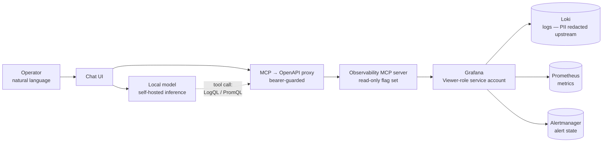
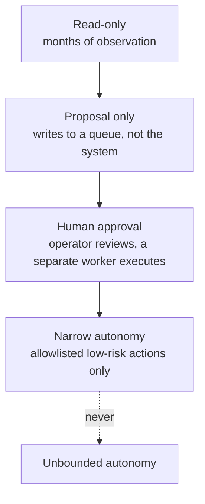

# 6. AI engineering

> **Read this first.** This document has two halves and they are not
> interchangeable. Everything under **Built and verified** is deployed and was
> exercised against live production data, with the measurements below taken from
> that run. Everything under **Designed, not built** is architecture and
> reasoning with **no implementation**. Nothing is described as existing that
> does not exist. The system prompt, tool configuration and internal AI logic
> from the production stack are not reproduced — see
> [SECURITY.md](../SECURITY.md).

## Why this system is a useful place to put an LLM

Operational questions about an ISP are natural-language questions over structured
telemetry: *did anything crash last night?*, *who logged into the box?*, *is that
site actually down or is the exporter dead?*

The answers already exist in Prometheus and Loki. The barrier is that answering
requires writing PromQL or LogQL, knowing the label schema, and knowing which
subsystem to ask. On a small team, that barrier is the difference between
checking and not checking.

That is a genuine retrieval-and-translation problem, which is what current
language models are good at. It is also a domain where being confidently wrong has
consequences, which is what makes it interesting rather than a demo.

---

# Built and verified

## A read-only operations agent over MCP tools

Every component binds loopback. The whole stack runs on **separate hardware from
production**, holds read-only credentials, and is not part of the production
deployment — by decision it never runs on the production host.

That separation is itself a security boundary and worth stating as a
requirement: an analysis tool with production access is a production system, and
it inherits the review, patching and access discipline of one. Running it beside
the workload it inspects is how a convenience becomes an entry point.

### The central design choice: tools, not text

**The model never reads a log file.** It has no filesystem access, no database
connection, and no log text in its context except what a tool call returned.

It calls tools that execute LogQL and PromQL queries against the real
observability stack, and reasons over the structured results.

This matters for four reasons, and they compound:

1. **Grounding.** An answer traces to a query that returned specific rows. There
   is a citable path from claim to evidence.
2. **Scale.** The relevant logs are gigabytes. Retrieval by query is the only
   approach that works; stuffing a context window is not a smaller version of it.
3. **Freshness.** A query hits live data. Nothing to index, nothing to go stale,
   no embedding pipeline to maintain.
4. **Auditability.** Tool calls are inspectable. "What did the assistant actually
   look at?" has an answer.

The general principle, which is the one I'd carry to any AI system: **give a model
a query interface to a system of record, not a copy of the records.**

### Read-only enforced twice, independently

Two mechanisms, chosen because they fail differently:

| Layer | Mechanism | Fails if... |
|---|---|---|
| Identity | Viewer-role service account | ...someone grants the account more permissions |
| Tool surface | Server flag that strips mutating tools from the schema | ...someone removes the flag |

Neither alone is sufficient, and that is the point. Defence in depth on an AI
tool surface means the model must not be *able* to write, not merely *instructed*
not to. Prompt-level restrictions are a request; the model cannot call a tool
whose schema was never sent to it.

A structural property worth noticing: with the mutating tools stripped, the
capability is absent rather than forbidden. There is no jailbreak for a tool that
isn't in the schema.

### PII is redacted before the model, not by the model

Log redaction happens at the shipping edge ([§5](05-observability-and-operations.md)),
which is *upstream* of the aggregator the model queries. Phone numbers, national
IDs, emails and names never reach the store the tools read.

The sequencing is the whole point. Asking a model to redact is asking the
component with the weakest guarantees to enforce the strongest requirement.
Redacting at the edge means the model *cannot* leak what it never received.

A small number of pseudonymous operational identifiers are deliberately
retained. They resolve to a person only against a store the model has no path
to, and keeping some such thread is what gives an investigation a starting
point — the prompt directs the model to use and report them. Which identifiers
those are is a decision to record privately rather than publish, since an
enumeration of what survives redaction is also a map of what to look for.

That is a considered privacy/utility trade with the residual risk written down —
not a default. Full redaction would have made the tool useless for its actual
purpose, which is tracing one subscriber's problem through the logs.

### Prompt engineering against *observed* failure modes

The agent's system prompt was not written in one pass. Its largest section was
added after the acceptance run, targeting five specific behaviours observed in
that run's transcript:

| Observed | Rule added |
|---|---|
| Narrated the query instead of calling the tool | Emit the call first; prose only after results return |
| Reported some matching rows, dropped others | Report every group found, or state what was omitted |
| Mislabelled the timezone | The data's zone is stated; use it |
| Omitted the query it ran | Cite the query that produced the answer |
| Offered a capability it does not have | Explicit boundaries — say what you cannot do |

The generalisable method: **treat the prompt as a bug-fix surface driven by
transcript review.** Write the minimum prompt, run it against a real task,
diff the output against ground truth, and add rules that target actual observed
defects. Every rule in that table can be traced to a specific line of a specific
transcript.

That fifth row is the most important one. A model that offers to create alerts it
cannot create is not making a small mistake — it is making a promise on the
system's behalf. An operations agent must know the edge of its own capability, and
the only reliable way to teach it is to enumerate the edge.

### Measured limits, not estimated

Acceptance passed on an 8-billion-parameter local model: asked *"any errors in the
last hour?"*, it selected the correct tool unaided, wrote valid LogQL, and
answered from real production data.

It took roughly an hour. The measurements, from the inference server's own
timing output:

| Measurement | Value |
|---|---|
| Total prompt | **9,216 tokens** |
| — of which tool schemas (15 tools) | **~7,100 tokens (77%)** |
| — of which system prompt | ~1,500 tokens |
| Prompt processing rate (2-core CPU, no GPU) | **3.8–4.7 tok/s** |
| Time to first output token | **~40 minutes** |
| Wall clock to finished answer | **~1 hour** |

The conclusion is a single sentence: **tool schemas dominated the prompt, and
prompt processing was the entire bottleneck.** Not generation. Not the model's
reasoning. Reading the tool definitions.

Four engineering consequences, all of which generalise well beyond this hardware:

1. **Tool count is a context-budget decision, not just a capability decision.**
   Fifteen tools cost ~7,100 tokens of *every single request*. Scoping the tool
   set improved both selection accuracy and latency. Broad tool surfaces are not
   free, and on a small model they are actively harmful.
2. **Schema *shape* matters as much as schema count.** A model roughly five times
   faster was tested and failed differently — it could not reliably populate 15
   complex schemas, producing empty arguments or narrating instead of calling. It
   was reliable with two or three *simple* tools. The natural fix is a small
   facade exposing a few coarse, simple tools that internally compose the complex
   ones. Designed, not built.
3. **Prefix caching changes the economics of multi-turn.** The follow-up turn
   carrying tool results reprocesses only new tokens, not all 9,216. So the first
   turn is expensive and subsequent turns are cheap — which argues for
   conversational sessions over one-shot invocations.
4. **The bottleneck was hardware and it was correctly identified as hardware.**
   The pipeline was proven correct; the box was a 15-watt two-core laptop under
   memory pressure, thermally throttling from 4.66 to 3.80 tok/s *during the run*.
   The remedy is a GPU host, scoped as its own unit of work. Diagnosing "this is
   correct but under-resourced" and not rewriting working software is a judgment
   call, and it was the right one.

### The silent failure that cost the most debugging time

The inference server's default context window was 4,096 tokens. The prompt was
~9,216.

The tool schemas were silently truncated. The model therefore **never saw the
tools** — and it did not report an error, refuse, or say anything was missing. It
answered from parameterised knowledge, confidently, without querying anything.
On one occasion it invented a plausible-looking tool.

There was no error message. The behaviour was indistinguishable from a model that
had chosen not to use tools. Several debugging rounds went into it.

Three lessons, and the third is the one I'd bring to any AI system:

- **Context limits truncate silently.** Truncation is not an error condition in
  most stacks. It is a size reduction that changes the semantics of your request
  and returns `200`.
- **Configuration in layers, all silent.** The working context setting had to be
  pinned in *two* places, and a third per-conversation override layer defaulted to
  a value *lower* than both — so touching one unrelated UI control silently broke
  tool calling. Each layer overrode quietly.
- **The failure looked like a capability problem.** The natural read is "this
  model is too weak to use tools". The actual cause was configuration. An AI
  system needs to distinguish *the model didn't* from *the model couldn't* from
  *the model was never told it could* — and by default it cannot, because all
  three produce the same output.

This is [§7](07-failure-modes-and-lessons.md) in a nutshell: a broken path
returning something that looked like success. Truncation returned `200`. The model
returned a fluent answer. Nothing anywhere reported a problem.

### A named threat: log-borne prompt injection

The logs this agent reads contain **attacker-influenceable strings**. A reverse
proxy logs request paths, and RADIUS logs usernames — both partly chosen by
whoever is connecting. Anyone who can generate a log line can put text in front of
the model.

This is registered as a security finding with a severity and an argued blast
radius, not hand-waved:

- **Reachable:** yes. Untrusted text reaches the model's context by design.
- **Consequence:** manipulated *conclusions* — a wrong or misleading answer to
  the operator.
- **Not reachable:** state change. The tools cannot write. There is no path from
  the model to billing, RADIUS, or a router.
- **Mitigation:** keep the read-only guarantees; treat model output as untrusted
  input to a human decision, never as an authority.

The reasoning generalises to every agent design I'd build: **you cannot prevent
injection into a context that includes untrusted data, so you bound what a
successfully-injected model is able to do.** Capability restriction is the
control. Prompt hardening is a mitigation of severity, not of likelihood.

## Deliberately *not* machine learning: the churn score

The production churn-risk score is not a model. It is transparent additive integer
points from a versioned rubric: payment-lateness level and trend, suspension
frequency, support-contact burst. Points sum, capped at 100.

Four properties that were worth more than accuracy here:

1. **A non-engineer can add up any score and defend it.** These scores drive
   conversations with real customers. "The model says you're a churn risk" is not
   a sentence anyone can act on.
2. **The breakdown is persisted.** Every scoring run writes its per-signal point
   contribution into the audit record. Explainability as a stored artifact, not a
   post-hoc reconstruction.
3. **The rubric is versioned in code; only the caps are configuration.** A signal
   can be tuned *down* without a deploy. Raising its real influence requires a
   reviewed code change — so the live behaviour cannot silently diverge from the
   committed rubric.
4. **A signal whose data source is not in place is stubbed to zero**, honestly,
   rather than being given a plausible default. It contributes nothing instead
   of contributing a guess, and the rubric documents that it is inert. An
   unstated default is a lie with a number attached — and a scoring system that
   quietly invents inputs is worse than one that admits it is incomplete.

**Why this is the AI-engineering-relevant choice.** Churn classification has a
data precondition that is easy to skip past: on the order of hundreds of
labelled examples as a floor and thousands to be comfortable, accumulated over
many months of operation, with heavy class imbalance because most subscribers
simply stay. Where that precondition is not met, fitting a classifier produces a
number with a decimal point and no more information than a rubric would give
you — plus an opacity problem and a maintenance burden. The honest move is to
name the precondition and check it before reaching for the model.

The ML design *is* written up — gradient boosting with SHAP attributions for the
churn classifier, seasonal-decomposition or isolation-forest anomaly detection for
network telemetry, with a nightly feature pipeline and a read-only inference
service that never writes to the billing database. It is a roadmap item with a
data precondition, not a claim.

Knowing when *not* to reach for a model, and being able to say precisely what
would have to be true first, is part of the job.

---

# Designed, not built

Everything below is architecture and reasoning. **None of it is implemented.**

## Candidate assistants, in the order the data supports them

| Capability | What it needs first | Why it's tractable |
|---|---|---|
| **Ops assistant (extension)** | GPU host; a small-schema tool facade | Built version works; blocked on compute |
| **Billing explanation** | Read-only, PII-minimised query views | Deterministic ground truth exists in the ledger |
| **Doc/runbook RAG** | Chunking + eval set over ~20k lines of operational docs | Bounded, curated, versioned corpus |
| **Support triage** | Interaction history is already schematised | Classification, with a human in the loop |
| **Network troubleshooting** | Site telemetry deployed | Correlating telemetry with subscriber state |

The ordering is not arbitrary — it is by *data readiness*, because each one is
gated on data that does or doesn't exist yet, and building the ungated ones first
is how AI projects produce demos instead of tools.

### Why billing explanation is the strongest next candidate

It is the rare LLM feature with **verifiable ground truth**. "Why was I charged
this?" has a deterministic answer computable from the ledger. So the assistant's
job is *explanation*, not calculation — retrieve the transactions, retrieve the
applicable rules, render the arithmetic in plain language, and cite each figure.

The architecture that makes that safe:

- The model **never computes an amount.** Figures come from tool calls; the model
  arranges them into prose. A model doing arithmetic on a bill is a defect.
- Every number in the answer carries its source record.
- A regression suite of question/ledger-state pairs with known-correct answers.
  Since the truth is computable, the eval set can be generated.

That last property is why it's next: it is the one where evaluation is cheap.

### RAG over the operational documentation

The corpus is real: roughly 20,000 lines of specs, decision records, runbooks and
defect registers, all versioned. It is the corpus that would most help a second
engineer.

The parts I'd expect to be hard, based on the corpus's actual shape:

- **Superseded decisions.** The decision log contains reversals — a later section
  explicitly overrides an earlier one, and the earlier one is *kept* for its
  reasoning. Naive retrieval over that corpus will confidently return retired
  architecture. Any honest design here needs supersession as retrievable
  metadata, not just as prose a human notices.
- **Deliberately-stale documents.** Several files are marked "do not read as
  current state" and are historically valuable but currently wrong. Status has to
  be a filterable property.
- **Chunking on structure.** These documents are hierarchical and
  cross-referential, with meaning carried by section numbers. Fixed-size chunking
  would shred them.

Those three are why "RAG over your docs" is a project rather than a weekend.

### If write access is ever added

The progression, as designed:

Controls, each mapping to a specific failure:

| Control | Prevents |
|---|---|
| **Allowlist, not denylist** — enumerated permitted actions | The action nobody thought to forbid |
| **Proposal queue** — the model writes an intent, a separate worker executes | Direct actuation from a manipulated context |
| **Human approval on sensitive actions** | Irreversible action on a wrong inference |
| **Rate limits with automatic halt** | A loop that disconnects the whole subscriber base |
| **Reversibility** — every action records prior state | An action you can't undo |
| **Kill switch** — one operation revokes the credential | Needing a code change to stop it |
| **Dedicated action audit table, permanent retention** | Not being able to reconstruct what it did |

Two of those are load-bearing in a way that's easy to miss. **Allowlist, not
denylist** is the difference between reasoning about what should be possible and
trying to enumerate every disaster. And the **proposal queue** is what makes the
approval step real: if the model can actuate directly, "human approval" is a
prompt instruction, and prompt instructions are not controls.

Sketches: [`examples/ai/approval_gate.py`](../examples/ai/approval_gate.py),
[`examples/ai/readonly_tool_gateway.py`](../examples/ai/readonly_tool_gateway.py).

### Evaluation

The parts I'd consider non-negotiable, and why each is hard *here*:

- **Grounding.** Does every factual claim trace to a tool result? Checkable
  mechanically by requiring citations and verifying they resolve. This is the
  cheapest high-value eval available and it is where I would start.
- **Completeness.** The acceptance run's actual defect was not a wrong answer —
  it was an *incomplete* one. It reported four matching log groups and silently
  dropped six. A correctness-only eval scores that as a pass. Completeness needs
  its own metric, scored against a ground-truth query run separately.
- **Calibration.** Truncated results, hit limits and empty ranges must be stated
  as such. "No errors found" and "no errors in the first 10 of an unknown number"
  are different answers, and a model that renders the second as the first is
  dangerous in an operations context.
- **Refusal quality.** Does it decline what it cannot do, rather than offering?
  Directly from an observed defect.
- **Injection resistance.** Adversarial log lines in a fixture corpus; assert the
  conclusions don't move.

Harness sketch: [`examples/ai/eval_harness.py`](../examples/ai/eval_harness.py).

### Observability for the AI layer

The same discipline as the rest of the platform, because an AI feature is a
production feature: log every tool call with arguments and latency; track
tool-selection accuracy, calls per answer, and answers-without-any-tool-call
(which, per the truncation bug, is a *symptom* worth alerting on); track prompt
and completion tokens per request against the measured budget above.

And the one this project's history makes unavoidable: **alert on a silent
degradation in tool-call rate.** If answers-without-tool-calls climbs, something
upstream broke quietly — and the failure will otherwise present as the assistant
having gently become useless.

---

**Next:** [7. Failure modes and lessons](07-failure-modes-and-lessons.md) ·
**Back:** [5. Observability and operations](05-observability-and-operations.md)
